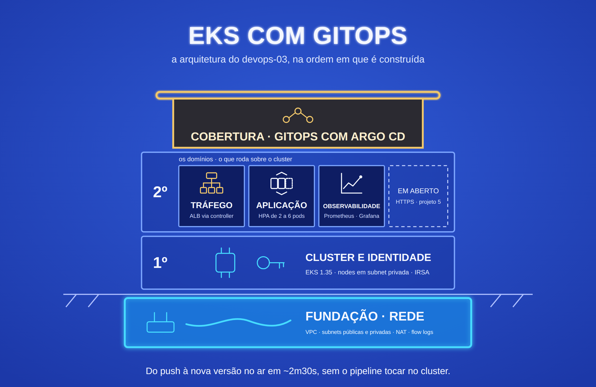

# devops-03-eks-gitops

API em Kubernetes (EKS) entregue por GitOps: o pipeline só publica a imagem e
grava a nova tag no Git, e o Argo CD, de dentro do cluster, aplica a mudança.
Autoscaling por CPU, métricas da aplicação no Prometheus, dashboard no Grafana
e alerta por e-mail via SNS, tudo criado e destruído pelo próprio projeto.

**Projeto 3 de 5 do portfólio DevOps** · Nível: intermediário/avançado ·
Anterior: [devops-02-ecs-microservice](https://github.com/robson-devops/devops-02-ecs-microservice)


## Stack

`AWS EKS` `Argo CD` `Kustomize` `Helm` `Prometheus` `Grafana` `Alertmanager` `SNS` `AWS Load Balancer Controller` `IRSA` `HPA` `ECR` `Terraform (módulos)` `GitHub Actions` `OIDC` `Python/FastAPI`

## O que este projeto acrescenta ao anterior

| Projeto 2 (ECS) | Projeto 3 (EKS) |
|---|---|
| Pipeline faz o deploy (push) chamando a API do ECS | Pipeline não acessa o cluster; o Argo CD puxa o estado do Git (pull) |
| 2 tasks fixas | HPA de 2 a 6 pods por CPU, com PDB e distribuição entre AZs |
| Tasks em subnet pública, sem NAT | Nodes em subnet privada, saída por NAT Gateway |
| Logs no CloudWatch, sem métricas da aplicação | Métricas da aplicação no Prometheus, dashboard no Grafana, alerta por e-mail |
| Mudança manual no ambiente fica | Mudança manual é revertida pelo Argo CD (self-heal) |
| Permissões da aplicação via task role | Permissões por pod via IRSA (Load Balancer Controller e Alertmanager) |

## Arquitetura

Diagrama e explicação dos fluxos em [`docs/architecture.md`](docs/architecture.md).

```
git push → teste do container → ECR (tag = SHA, via OIDC)
        → commit da nova tag em gitops/ → Argo CD sincroniza → rolling update
usuário → ALB (criado pelo Load Balancer Controller) → pods em subnets privadas
Prometheus → coleta /metrics → regra dispara → Alertmanager → SNS → e-mail
```

## Decisões de Arquitetura

**GitOps com Argo CD, e o pipeline sem acesso ao cluster.** A role do GitHub
Actions só consegue publicar imagem num repositório ECR. Quem aplica no
cluster é o Argo CD, que lê o Git. O estado desejado fica versionado, qualquer
deploy é um commit (auditável e revertível com `git revert`) e um vazamento da
credencial do pipeline não dá acesso ao cluster.

**App of apps.** O Terraform cria uma única Application, a `root`, que aponta
para `gitops/apps/`. Cada arquivo ali é uma aplicação (`demo-api` e
`monitoring`). Uma aplicação nova entra no cluster com um commit, sem mexer no
Terraform.

**Terraform só até o Argo CD.** Rede, EKS, Load Balancer Controller, Argo CD e
as identidades AWS ficam no Terraform. Tudo que roda dentro do cluster depois
disso é do Argo CD. Se os dois gerenciassem os mesmos objetos, um desfaria a
mudança do outro.

**Nodes em subnet privada.** Os nodes não têm IP público; só o ALB fica na
subnet pública. A saída para a internet (ECR, Docker Hub, GitHub) passa por um
NAT Gateway. É o oposto do Projeto 2, que evitou o NAT por custo: aqui o
isolamento dos nodes vale os ~US$ 32/mês.

**IRSA em vez de permissão nos nodes.** O Load Balancer Controller e o
Alertmanager recebem cada um a sua role, amarrada à service account pelo OIDC
do cluster. A role dos nodes fica só com o mínimo do EKS; um pod qualquer não
herda permissão para criar load balancer nem publicar no SNS.

**API do cluster pública, mas restrita.** O endpoint público só aceita o CIDR
de quem opera (`operator_cidr`, obrigatório e sem `0.0.0.0/0`). O tráfego dos
nodes usa o endpoint privado. O acesso é por access entries da API do EKS, sem
o antigo ConfigMap `aws-auth`.

**Autoscaling horizontal com proteção na manutenção.** O HPA varia de 2 a 6
pods por CPU (alvo de 60%). O Deployment não declara `replicas`, senão cada
sync do Argo CD brigaria com o HPA. O PDB garante 1 pod no ar durante a troca
de nodes, e o `topologySpreadConstraints` distribui os pods entre as AZs.

**Métricas da própria aplicação.** A API expõe `http_requests_total` e
`http_request_duration_seconds` em `/metrics`, rotuladas pela rota declarada
(não pela URL crua, para não criar uma série por query string). Um
ServiceMonitor faz o Prometheus coletar, e três regras viram alerta: taxa de
erro 5xx acima de 5%, p95 acima de 500 ms e aplicação fora do ar.

**Alerta por e-mail sem credencial guardada.** O Alertmanager publica no SNS
com assinatura SigV4, usando a role IRSA. Não há senha de SMTP nem chave em
lugar nenhum. O tópico é cifrado com a chave gerenciada pela AWS, e a role só
pode publicar nele.

**Imagem rastreável até o commit.** O ECR é imutável e a tag é o SHA do commit.
O `/health` devolve esse SHA, então dá para saber qual versão está respondendo
sem acessar o cluster.

**Nada fica para trás na conta.** O projeto cria e o destroy apaga o bucket do
state, os providers OIDC (GitHub e EKS), as roles, o tópico SNS e o log group
do control plane, que é criado antes do cluster com retenção de 7 dias (se a
AWS o criasse, ficaria sem retenção e fora do Terraform). O
[`scripts/verificar-cobranca.sh`](scripts/verificar-cobranca.sh) confere o
resultado.

## Trade-offs Avaliados

| Decisão | Escolhido | Alternativa | Critério |
|---|---|---|---|
| Entrega no cluster | Argo CD (pull) | `kubectl apply` no pipeline (push) | Pipeline sem credencial do cluster, drift corrigido, deploy = commit |
| Manifestos da aplicação | Kustomize | Helm chart próprio | Uma aplicação sem variações por ambiente; `kustomize edit set image` basta para o pipeline |
| Observabilidade | kube-prometheus-stack via Argo CD | CloudWatch Container Insights / AMP e AMG | Stack padrão de mercado, sem custo por métrica; mesma ferramenta de qualquer Kubernetes |
| Retenção do Prometheus | 6h, sem volume | PVC no EBS | Um PVC deixaria um volume EBS para trás no destroy; ambiente efêmero |
| Canal de alerta | SNS com IRSA | SMTP (Gmail, SES) | Nenhuma senha a guardar; a role só publica em um tópico |
| Saída dos nodes | 1 NAT Gateway | 1 NAT por AZ | Um NAT por AZ dobra o custo fixo; perder a AZ do NAT corta só a saída, não o tráfego de entrada |
| Load balancer | AWS Load Balancer Controller | Service `LoadBalancer` (CLB) | ALB com health check na rota `/ready` e target direto no IP do pod |
| Repositórios | App e manifestos no mesmo repo | Repo de app + repo de GitOps | Mais simples para ler; o custo é o `git pull --rebase` depois de cada deploy |
| Versão do Kubernetes | 1.35 (N-1) | 1.36 (última) | Add-ons e charts de terceiros costumam chegar primeiro na versão anterior |
| Nodes | Managed node group, 2 × t3.medium | Fargate / Karpenter | DaemonSets do Prometheus exigem nodes; Karpenter é operação a mais para 2 nodes |

## Melhorias Mensuráveis

Medido na AWS em 30/09/2026, não estimado:

| Métrica | Resultado |
|---|---|
| Push no Git até a nova versão rodando (pipeline completo) | **~2 min 30 s** (push 19:46:36, pods novos 19:49:06 e 19:49:10 UTC) |
| Commit em `gitops/` até o cluster aplicar | **55 s** |
| Mudança manual revertida pelo Argo CD (namespace apagado) | **3 s** |
| HPA sob carga: decisão de escalar de 2 para 6 pods | **~6 s** após o início da carga; 6 pods rodando ~18 s depois (3 por AZ) |
| HPA após a carga: volta a 2 pods | **~2 min** (janela de estabilização de 120 s) |
| Primeiro erro até o alerta disparar no Prometheus | **2 min 32 s** (pendente em 41 s, `for: 2m`) |
| Primeiro erro até o e-mail de ALERTA | **~3 min** |
| Credenciais estáticas da AWS no GitHub ou no cluster | **0** |
| Permissão do pipeline sobre o cluster | **nenhuma** (só publicar no ECR) |
| Remoção em cascata das aplicações (Application `root`) | **24 s**, com o ALB removido pelo controller |
| Varredura `checkov` | Terraform **192 passaram, 0 falharam** (12 exceções justificadas); manifestos renderizados **93 / 0** (2 exceções); Dockerfile **53 / 0**; workflow **52 / 0** |
| Recursos do projeto na conta após o ciclo completo | **0**, verificado pelo `scripts/verificar-cobranca.sh` |

Como cada número foi obtido: [`docs/validacao-aws.md`](docs/validacao-aws.md).

## Limitações Conhecidas

- **Sem HTTPS.** O ALB só escuta em HTTP, pelo mesmo motivo do Projeto 2 (sem
  domínio com DNS no Route 53). Resolvido no Projeto 5.
- **Consoles só por port-forward.** Argo CD, Grafana, Prometheus e Alertmanager
  não são expostos. É mais seguro, mas o link do e-mail de alerta só abre com o
  port-forward do Prometheus ativo.
- **Quantidade de nodes fixa.** O node group tem 2 nodes e não há Cluster
  Autoscaler nem Karpenter. O HPA escala pods até caber nos 2 nodes.
- **Um NAT Gateway só.** Se a AZ dele cair, os nodes da outra AZ perdem a saída
  para a internet (pull de imagem nova), mas continuam servindo tráfego.
- **Métricas voláteis.** O Prometheus guarda 6 horas, em disco efêmero. Um
  restart do pod perde o histórico.
- **Um único Alertmanager e um único Prometheus.** Sem alta disponibilidade da
  observabilidade.
- **Senha inicial do Argo CD e do Grafana em Secrets do cluster.** Adequado para
  laboratório; em produção, SSO (Dex/OIDC) e External Secrets.
- **IDs da conta nos manifestos.** `gitops/` referencia o ECR, a role do
  Alertmanager e o tópico SNS pelo ID da conta. Num fork, é preciso trocar (ver
  *Pré-requisitos*).

## Estrutura

```
.
├── app/                          # API FastAPI com /metrics + Dockerfile
├── bootstrap/                    # bucket do state (state local)
├── terraform/
│   ├── terraform.tf · providers.tf · main.tf
│   ├── variables.tf · outputs.tf · locals.tf
│   └── modules/
│       ├── network/                   # VPC, subnets, NAT, flow logs, SG default
│       ├── eks/                       # cluster, node group, add-ons, OIDC, log group
│       ├── load_balancer_controller/  # role IRSA e chart do controller
│       ├── argocd/                    # chart do Argo CD e Application root
│       ├── ecr/                       # repositório imutável
│       ├── alert_notification/        # tópico SNS, assinatura e role IRSA
│       └── pipeline_identity/         # provider OIDC e role do GitHub Actions
├── gitops/
│   ├── apps/                     # Applications filhas da root
│   │   ├── demo-api.yaml
│   │   └── monitoring.yaml       # kube-prometheus-stack + config do Alertmanager
│   └── demo-api/                 # Kustomize: Deployment, HPA, PDB, Ingress,
│                                 # ServiceMonitor, PrometheusRule, dashboard
├── scripts/verificar-cobranca.sh # confere que nada ficou na conta
├── tests/alb-smoke.yaml          # teste descartável do controller (etapa 3)
├── .github/workflows/ci-cd.yml
└── docs/                         # arquitetura e validação na AWS
```

## Custo

Aproximadamente **US$ 0,27 por hora** com tudo no ar (preços da us-east-1):
control plane do EKS (US$ 0,10), 2 × t3.medium (US$ 0,083), NAT Gateway
(US$ 0,045), ALB (US$ 0,023) e IPs públicos. Um ciclo de estudo de 4 horas sai
por pouco mais de US$ 1. Destrua ao terminar: parado, o ambiente continua
cobrando.

## Pré-requisitos

### Ferramentas

Terraform `>= 1.14`, AWS CLI, `kubectl`, GitHub CLI (`gh`) e `git`. Docker só
é necessário para rodar a aplicação localmente.

> No macOS, o formula `terraform` do Homebrew core está parado na 1.5.7. Use o
> tap oficial: `brew install hashicorp/tap/terraform`.

A AWS CLI é usada também pelo Terraform e pelo `kubectl` para gerar o token do
cluster (`aws eks get-token`). Funciona na v2 e nas versões recentes da v1.

### Identidades

| Identidade | O que é | Como obter |
|---|---|---|
| **Operador** | Quem roda o Terraform e o `kubectl` | Usuário IAM seu, com permissão em VPC, EC2, EKS, ELB, ECR, IAM (roles e providers OIDC), S3, SNS, KMS (uso da chave `aws/sns`) e CloudWatch Logs |
| **Pipeline** | O GitHub Actions | Role criada pelo Terraform (`pipeline_identity`), sem chave a gerar |
| **Pods** | Load Balancer Controller e Alertmanager | Roles IRSA criadas pelo Terraform |

Quem roda o `terraform apply` vira administrador do cluster
(`bootstrap_cluster_creator_admin_permissions`). Outra identidade só enxerga o
cluster se ganhar um access entry.

### Login na AWS e no GitHub

O Terraform, o `kubectl` e a AWS CLI usam a mesma credencial, a do perfil
ativo na sua máquina.

**Usuário IAM com access key:**

```bash
aws configure
```

**AWS IAM Identity Center (SSO):**

```bash
aws configure sso
aws sso login --profile <seu-perfil>
export AWS_PROFILE=<seu-perfil>
```

Confira a conta onde tudo será criado:

```bash
aws sts get-caller-identity
```

O `gh` precisa estar autenticado no dono do repositório, para gravar o secret
do pipeline e disparar o workflow:

```bash
gh auth login
gh auth status
```

### Provider OIDC do GitHub

O projeto cria o provider e o destroy o remove. Ele é único por conta AWS;
confira se outro projeto já o criou:

```bash
aws iam list-open-id-connect-providers \
  --query "OpenIDConnectProviderList[?contains(Arn, 'token.actions.githubusercontent.com')].Arn" \
  --output text
```

Se imprimir um ARN, use `create_oidc_provider = false` no `terraform.tfvars`: o
projeto só o referencia e não o apaga no destroy.

### Se você fez fork

O Argo CD lê o **seu** repositório, e os manifestos apontam para recursos da
**sua** conta. Troque:

1. No `terraform.tfvars`: `gitops_repository_url` e `github_repository`.
2. Em `gitops/apps/*.yaml`: o `repoURL` de `robson-devops/devops-03-eks-gitops`
   para o seu repositório.
3. O ID da conta AWS em `gitops/`:

   ```bash
   ACCOUNT_ID=$(aws sts get-caller-identity --query Account --output text)
   perl -pi -e "s/675344342862/${ACCOUNT_ID}/g" \
     $(grep -rl 675344342862 gitops)
   ```

Faça commit e push dessas mudanças **antes** do `terraform apply`: o Argo CD
começa a ler o repositório assim que sobe.

## Como executar

Todos os comandos rodam da raiz do projeto.

**1. Configurar as variáveis.** O `terraform.tfvars` fica fora do Git.

```bash
cp terraform/terraform.tfvars.example terraform/terraform.tfvars
curl -s https://checkip.amazonaws.com
```

No `terraform.tfvars`, informe o seu IP em `operator_cidr` (ex:
`["203.0.113.10/32"]`) e, se quiser receber os alertas, `alert_email`. Se
preferir não gravar o e-mail em arquivo, use a variável de ambiente
`export TF_VAR_alert_email="voce@exemplo.com"` na sessão do terminal.

**2. Criar o bucket do state.** A camada `bootstrap/` tem state local, porque
não pode guardar o próprio state no bucket que ela cria.

```bash
terraform -chdir=bootstrap init
terraform -chdir=bootstrap apply
```

**3. Inicializar o projeto apontando para esse bucket.** Se a pasta
`terraform/` já foi inicializada com outro bucket, acrescente `-reconfigure`.

```bash
terraform -chdir=terraform init \
  -backend-config="bucket=$(terraform -chdir=bootstrap output -raw state_bucket_name)"
```

**4. Criar a infraestrutura.** Leva cerca de 20 minutos; o cluster e o node
group são a parte mais lenta.

```bash
terraform -chdir=terraform apply
```

Ao final, o Argo CD já está sincronizando `gitops/apps/`. A `demo-api` fica em
`ImagePullBackOff` até o passo 7, porque o ECR acabou de ser criado e ainda
está vazio. Se a assinatura do e-mail já estiver confirmada, nesse intervalo
chega o alerta `DemoApiDown`, seguido do RESOLVIDO quando a imagem sobe.

**5. Confirmar a assinatura do e-mail** (se informou `alert_email`). A AWS
envia "AWS Notification - Subscription Confirmation"; clique em *Confirm
subscription*. Sem isso, o SNS não entrega os alertas. A cada recriação o
tópico é novo, e a confirmação precisa ser feita de novo.

**6. Configurar o `kubectl`.**

```bash
eval "$(terraform -chdir=terraform output -raw kubeconfig_command)"
kubectl get nodes
```

Esperado: 2 nodes `Ready`.

**7. Configurar o pipeline e publicar a primeira imagem.** O único secret é o
ARN da role, um identificador e não uma credencial. A role é recriada a cada
ciclo, então o secret também.

```bash
gh secret set AWS_ROLE_ARN \
  --body "$(terraform -chdir=terraform output -raw pipeline_role_arn)"
gh workflow run ci-cd.yml --ref main
gh run watch
```

O pipeline publica a imagem com a tag do commit atual e grava essa tag em
`gitops/demo-api/kustomization.yaml`. Traga o commit do bot:

```bash
git pull --rebase
```

**8. Acessar a aplicação.** O ALB leva de 2 a 3 minutos para ficar ativo depois
que o Ingress é criado.

```bash
ALB=$(kubectl -n demo-api get ingress demo-api \
  -o jsonpath='{.status.loadBalancer.ingress[0].hostname}')
curl "http://$ALB/health"
```

Esperado: `{"status":"ok","version":"<sha do commit>"}`.

### Fluxo de deploy

Todo push na `main` que altere `app/` testa, publica e faz o deploy. Como o bot
também faz commit na `main`, rode `git pull --rebase` antes do próximo push (ou
configure uma vez `git config pull.rebase true`). O bot só altera
`gitops/demo-api/kustomization.yaml`, então o rebase não gera conflito.

### Consoles

Todas por port-forward, um de cada vez:

| Console | Comando | Endereço | Login |
|---|---|---|---|
| Argo CD | `kubectl -n argocd port-forward svc/argocd-server 8080:443` | https://localhost:8080 (certificado autoassinado; aceite o aviso) | `admin` e a senha abaixo |
| Grafana | `kubectl -n monitoring port-forward svc/monitoring-grafana 3000:80` | http://localhost:3000 | `admin` e a senha abaixo |
| Prometheus | `kubectl -n monitoring port-forward svc/monitoring-kube-prometheus-prometheus 9090:9090` | http://localhost:9090 | sem login |
| Alertmanager | `kubectl -n monitoring port-forward svc/monitoring-kube-prometheus-alertmanager 9093:9093` | http://localhost:9093 | sem login |

Senha do Argo CD:

```bash
eval "$(terraform -chdir=terraform output -raw argocd_admin_password_command)"; echo
```

Senha do Grafana:

```bash
kubectl -n monitoring get secret monitoring-grafana \
  -o jsonpath='{.data.admin-password}' | base64 -d; echo
```

O dashboard da aplicação fica em **Dashboards → demo-api**.

### Testar o alerta por e-mail

Um pod que chama `/error` sem parar:

```bash
kubectl -n demo-api run erros \
  --image=curlimages/curl:8.16.0 \
  --restart=Never \
  --command -- sh -c \
  'while true; do curl -s -o /dev/null http://demo-api/error; sleep 0.2; done'
```

O e-mail **[ALERTA] DemoApiHighErrorRate** chega em cerca de 3 minutos. Para
encerrar e receber o **[RESOLVIDO]**, cerca de 5 a 7 minutos depois:

```bash
kubectl -n demo-api delete pod erros
```

### Encerrar sem deixar nada na conta

**1. Apagar a Application `root`.** O finalizer faz o Argo CD apagar as
aplicações filhas e os recursos delas; ao sumir o Ingress, o Load Balancer
Controller apaga o ALB e os security groups `k8s-*`. Isso precisa acontecer
antes do `terraform destroy`: se o Argo CD e o controller forem desinstalados
primeiro, ninguém remove o ALB, e os security groups que sobram impedem o
destroy da VPC.

```bash
kubectl -n argocd delete application root --timeout=10m
```

**2. Conferir que o ALB e os security groups sumiram.** Nada deve aparecer.

```bash
aws elbv2 describe-load-balancers \
  --query 'LoadBalancers[?starts_with(LoadBalancerName, `k8s-`)].LoadBalancerName' \
  --output text
aws ec2 describe-security-groups \
  --filters Name=vpc-id,Values="$(terraform -chdir=terraform output -raw vpc_id)" \
  --query 'SecurityGroups[?starts_with(GroupName, `k8s-`)].GroupName' \
  --output text
```

**3. Destruir a infraestrutura, o bucket do state, e conferir.** O destroy
leva de 12 a 18 minutos.

```bash
terraform -chdir=terraform destroy
terraform -chdir=bootstrap destroy
./scripts/verificar-cobranca.sh us-east-1
```

Esperado: `Nada encontrado nas regiões verificadas nem nos serviços globais.`
Sem argumento, o script varre todas as regiões habilitadas da conta.

No destroy, o Helm avisa que manteve as CRDs do Argo CD
(`applications.argoproj.io` e outras). O chart faz isso de propósito, para não
apagar Applications de quem desinstala só o Argo CD. Aqui elas somem junto com
o cluster.

### Aplicação local

```bash
python3 -m venv .venv && source .venv/bin/activate
pip install -r app/requirements.txt
APP_VERSION=local uvicorn main:app --app-dir app --port 8000
```

## Observações

- **A Application raiz se chama `root`.** Renomeá-la no Terraform faz o Helm
  apagar a antiga, e o finalizer apaga junto todas as aplicações filhas e os
  recursos delas. O nome não deve mudar com o ambiente no ar.
- **Ver os objetos do Kubernetes pela console da AWS** exige um access entry
  para a identidade logada na console. Sem ele, a aba *Resources* do EKS mostra
  `Unauthorized`, mesmo para quem criou o cluster pela CLI com outro usuário.
- **Até 17 pods por node t3.medium.** Com a VPC CNI, cada pod usa um IP da
  interface de rede do node, e o t3.medium comporta 17. O monitoring ocupa boa
  parte, por isso o HPA tem teto de 6 réplicas.
- **Role IRSA adicionada com o cluster no ar.** A credencial da role só é
  injetada quando o pod é criado. Se a anotação da service account mudar com o
  pod rodando, recrie o pod (`kubectl delete pod ...`). Numa instalação do zero
  isso não acontece.
- **Actions em Node.js 24.** O workflow usa `actions/checkout@v6`,
  `aws-actions/configure-aws-credentials@v6` e `aws-actions/amazon-ecr-login@v2`,
  todas já em Node 24.

## Validação

Procedimento de validação na AWS, camada por camada, com os comandos e as
saídas esperadas: [`docs/validacao-aws.md`](docs/validacao-aws.md).

Validação estática, executada antes de cada entrega (além do Terraform, usa
`tflint`, `checkov`, `actionlint`, `kustomize`, `yq` e `promtool`):

```bash
terraform fmt -check -recursive
terraform -chdir=bootstrap validate
terraform -chdir=terraform validate
tflint --chdir=terraform --recursive
tflint --chdir=bootstrap
checkov -d . --framework terraform
checkov -d gitops/demo-api --framework kustomize
checkov -f app/Dockerfile
checkov -d .github --framework github_actions
actionlint .github/workflows/ci-cd.yml
kustomize build gitops/demo-api > /dev/null
promtool check rules <(yq '.spec' gitops/demo-api/prometheusrule.yaml)
```
