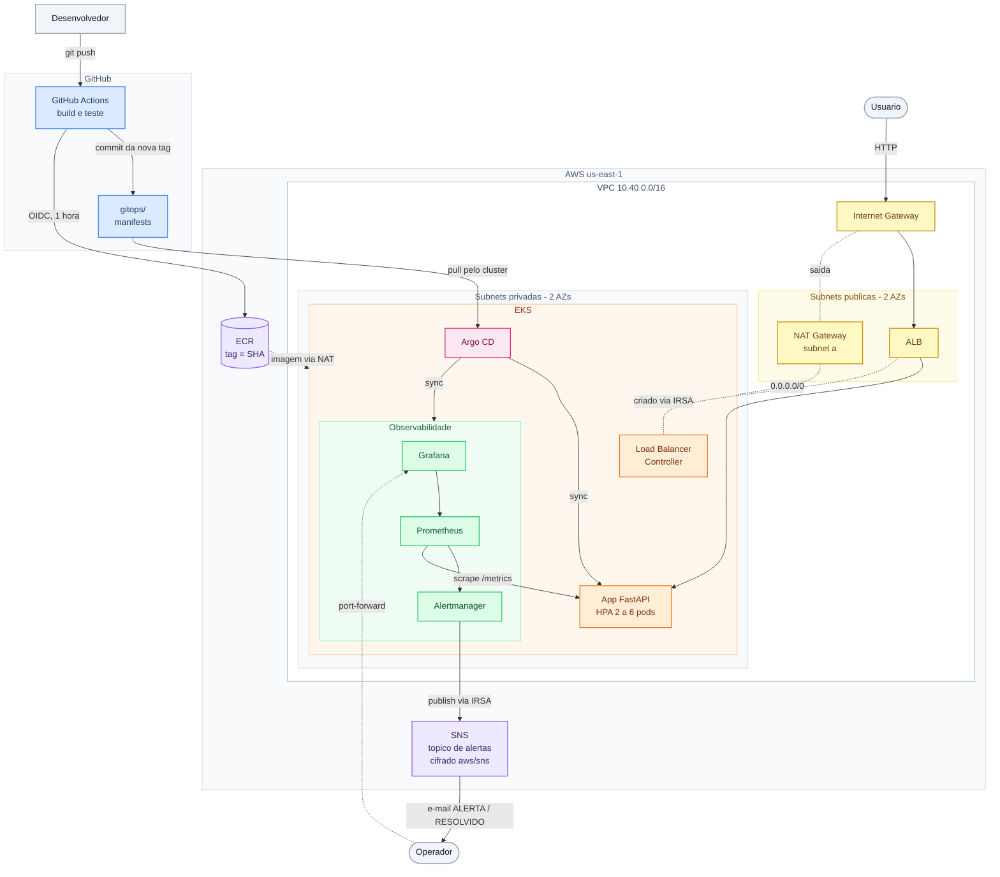

# Arquitetura: devops-03-eks-gitops

## Fluxo de deploy (GitOps)

1. O push na `main` que altera `app/` dispara o workflow `ci-cd.yml`.
2. O job `build-and-test` constrói a imagem com o SHA do commit em
   `APP_VERSION` e testa o container: `/health` devolvendo o SHA, `/ready`,
   `/work`, `/error` devolvendo 500 e a métrica do erro em `/metrics`.
3. Com o token OIDC do GitHub, o job assume a role do pipeline por até 1 hora
   e publica a imagem no ECR com a tag do SHA. O ECR é imutável; se a tag já
   existe (reexecução no mesmo commit), o push é pulado.
4. O job `update-manifest` roda `kustomize edit set image` em
   `gitops/demo-api/kustomization.yaml` e faz o commit como
   `github-actions[bot]`. Esse commit não dispara o workflow de novo: altera só
   `gitops/` e foi feito com o `GITHUB_TOKEN`.
5. O Argo CD compara o Git com o cluster a cada 60 s (mais até 10 s de
   jitter), detecta a nova tag e aplica. O Deployment faz rolling update, e o
   ALB só manda tráfego para o pod novo quando `/ready` responde.

A role do pipeline não tem nenhuma permissão no EKS. O `concurrency` do
workflow impede que dois pushes seguidos disputem o commit do manifesto.

## Fluxo da requisição

1. O usuário chama o ALB, na subnet pública.
2. O ALB manda direto para o IP do pod (`target-type: ip`), nas subnets
   privadas, sem passar por NodePort.
3. O ALB e o target group foram criados pelo AWS Load Balancer Controller a
   partir do Ingress da `demo-api`, usando a role IRSA do controller.

## Fluxo do alerta

1. O Prometheus coleta `/metrics` dos pods pelo ServiceMonitor a cada 15 s.
2. A PrometheusRule avalia as três regras. `DemoApiHighErrorRate` fica
   pendente quando a taxa de 5xx passa de 5% e dispara se continuar assim por
   2 minutos.
3. O Alertmanager agrupa por `alertname` e `namespace`, espera 30 s
   (`group_wait`) e roteia: `Watchdog` vai para o receiver `null`, alertas do
   namespace `demo-api` vão para o receiver `email`.
4. O receiver `email` publica no tópico SNS com SigV4, usando a role IRSA do
   Alertmanager. O template monta assunto e corpo legíveis
   (`[ALERTA]`/`[RESOLVIDO]`, severidade, resumo, início e fim em UTC).
5. O SNS entrega na assinatura de e-mail confirmada.

O RESOLVIDO sai no próximo ciclo do grupo (`group_interval` de 5 minutos),
não no instante em que o alerta some.

## Camadas e responsáveis

| Camada | Quem cria | Onde está |
|---|---|---|
| Bucket do state | Terraform (state local) | `bootstrap/` |
| VPC, subnets, NAT, flow logs | Terraform | `terraform/modules/network` |
| EKS, node group, add-ons, OIDC do cluster | Terraform | `terraform/modules/eks` |
| AWS Load Balancer Controller e sua role | Terraform (Helm) | `terraform/modules/load_balancer_controller` |
| Argo CD e a Application `root` | Terraform (Helm) | `terraform/modules/argocd` |
| ECR, SNS, roles do pipeline e do Alertmanager | Terraform | `terraform/modules/{ecr,alert_notification,pipeline_identity}` |
| kube-prometheus-stack | Argo CD | `gitops/apps/monitoring.yaml` |
| demo-api (Deployment, HPA, Ingress, métricas, alertas, dashboard) | Argo CD | `gitops/demo-api/` |

A fronteira é o Argo CD: o que roda dentro do cluster depois dele é do Git, e
o Terraform não gerencia nenhum desses objetos.

## Rede

| Faixa | Uso |
|---|---|
| `10.40.0.0/16` | VPC |
| `10.40.0.0/20`, `10.40.16.0/20` | Subnets públicas (a, b): ALB e NAT |
| `10.40.128.0/20`, `10.40.144.0/20` | Subnets privadas (a, b): nodes e pods |

As subnets são /20 porque, com a VPC CNI, cada pod recebe um IP da subnet. As
públicas têm a tag `kubernetes.io/role/elb` e as privadas
`kubernetes.io/role/internal-elb`, que o Load Balancer Controller usa para
escolher onde criar o ALB.
